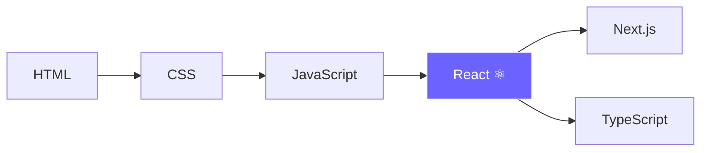

<!-- ═══════════ HEADER ═══════════ -->

 

---

## 👋 About Me

I'm **Chris**, a self-taught frontend developer who fell in love with the web one `
` at a time. No bootcamp, no classroom, just curiosity, late nights, and a lot of "why isn't this centered?" moments.

I started with **HTML and CSS**, got hooked on bringing pages to life with **JavaScript**, and I'm now stepping into the **React** world to build faster, cleaner, and more scalable interfaces.

|  |  |
|:--|:--|
| 🧠 **How I learn** | By building, breaking, and fixing |
| ⚛️ **Right now** | Getting comfortable with React components, props, state and hooks |
| 🎨 **What I enjoy** | Clean layouts, smooth interactions, and responsive design |
| 🌍 **My approach** | Learn in public, stay consistent, keep shipping |
| 🤝 **Open to** | Collaborations, code reviews, and open-source contributions |

---

## 🛠️ Tech Stack

**Core Skills**

**Currently Learning**

**Tools**

---

## 💻 I Built My Own IDE

No PC? No problem. I built **[CodeMini IDE](https://the-code-mini-native-ide.vercel.app)**, a code editor that runs right in the browser and works on mobile, so I can code from anywhere.

**What's inside:**

- 📁 File explorer with files, folders and workspaces
- 🔍 Search & replace across the project
- ▶️ Run code and see output in a built-in console
- 👁️ Live preview of your pages
- 🌿 Source control
- 🚀 One-click deploy
- 🤝 Live collaboration
- 🎨 SVG editor
- 🧘 Zen mode for distraction-free coding and many more features like terminal, console etc

---

## 📊 GitHub Stats

 

 

---

## 🚀 My Journey

---

## 📚 My Learning Path

---

## 🤝 Let's Connect

<!-- Replace the links below with your own -->

 

> *"First, solve the problem. Then, write the code."* — John Johnson

 

⭐ **If you like what you see, drop a star on my repos!** ⭐

